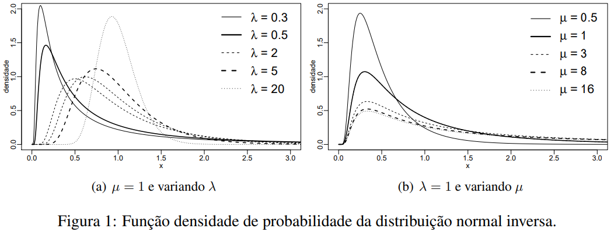
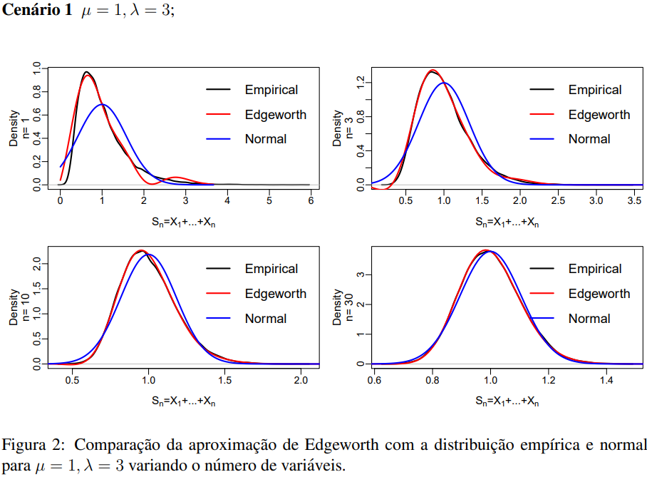
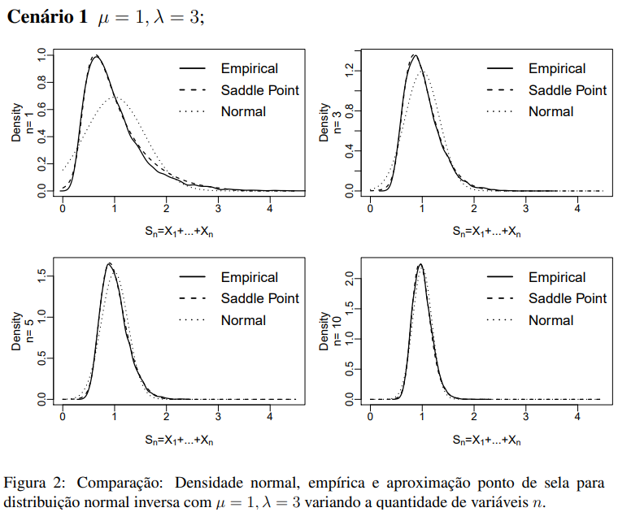
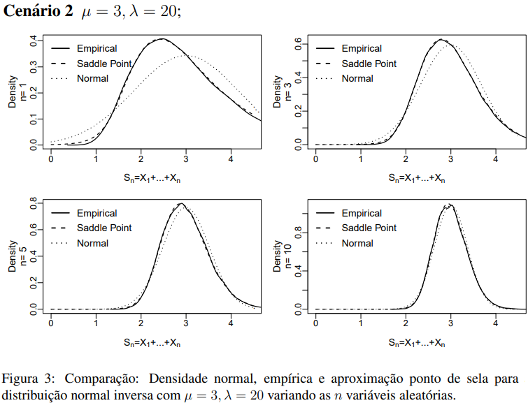

## Expansões Assintóticas

As expansões assintóticas são essenciais para analisar e entender fenômenos complexos em diferentes campos da matemática, física, estatística, engenharia e ciências aplicadas. Elas são especialmente úteis em situações complexas  quando as abordagens tradicionais se tornam impraticáveis ou insuficientes pois a expressão analítica exata é difícil ou impossível de obter. Assim, elas permitem uma descrição **aproximada** de funções complexas em regimes extremos em torno de um ponto específico ou quando um parâmetro tende a valores muito grandes ou pequenos. 

No meio estatístico e na teoria das probabilidades, as expansões de Edgeworth e ponto de sela (Saddle point) são úteis em problemas relacionados a distribuições de médias amostrais e outras estatísticas em amostras grandes. Ou seja, obter aproximações assintóticas para a densidade de probabilidade de uma soma de variáveis aleatórias independentes e identicamente distribuídas.
Em especial, a expansão de Edgeworth melhora a precisão da aproximação de Laplace, que é uma aproximação de primeira ordem baseada no método de Laplace (o qual possui uma exemplo prático neste repositório em [Aplicação da aproximação de Laplace](https://github.com/CarlosManchini/asymptotic_expansions/blob/main/Aplica%C3%A7%C3%A3o%20da%20aproxima%C3%A7%C3%A3o%20de%20Laplace.pdf).

Esses métodos de aproximação nos fornecem a capacidade de reduzir a quantidade de variáveis aleatórias independentes de uma  estimativa e pode gerar resultados mais estáveis, eficientes, interpretáveis e teoricamente válidos. Isso é particularmente importante quando se trabalha com dados complexos e modelos estatísticos, onde a simplicidade e a precisão são considerações cruciais. 

 ***
Adicionalmente, um aplicativo open-web foi desenvolvido em linguagem Shiny para explorar diferentes cenários da aplicação das aproximações assintóticas para a densidade da normal inversa (*inverse Gaussian*). A comparação é realizada com a versão empírica da densidade e com a distribuição normal garantida pelo Teorema Central do Limite (TCL). A aplicação possibilita ao usuário criar diferentes cenários e valores paramétricos para testar o comportamento dos métodos.
  Acesso do **App** disponível em [Shiny App](https://ufsm.shinyapps.io/appig/ "Approximations of the inverse Gaussian distribution").
***
#### Distribuição Normal Inversa

A distribuição normal inversa foi proposta formalmente por Wald em 1947. Contudo, a distribuição provém do trabalho de Tweedie em 1945, a partir do estudo da relação inversa entre as funções geratriz de cumulantes da distribuição normal e do primeiro tempo de passagem. Vinculado, destaca-se a utilização da distribuição normal inversa para descrever o movimento browniano, caracterizado como um dos mais simples e onipresente processo estocástico. Inclusive, a distribuição já foi chamada de *``Gaussian first passage time distribution''*. Sua aplicabilidade como variável aleatória descrevendo um primeiro tempo de passagem é bastante ampla. Por exemplo, o estudo de tempo de vida em uma variedade de campos, número de ocorrências de eventos, análise do risco financeiro, incidência de compras, duração de greves, entre outros. A distribuição em questão diferencia-se da normal, principalmente por possuir cauda longa que possui melhor adequabilidade a valores grandes.

Seja uma variável aleatória $X$ contínua que segue distribuição normal inversa com parâmetros $\mu$ e $\lambda$, denotada por $X \sim IG(\mu,\lambda)$. Sua função densidade de probabilidade é dada por:

$$  f(x;\mu,\lambda) =  \left( \frac{\lambda}{2\pi x^3} \right)^{1/2} \exp\left[ -\frac{\lambda(x-\mu)^2}{2\mu^2 x} \right], \qquad \mu, \lambda > 0. $$

A média e a variância são dadas, respectivamente: $$\mathbb{E}(X)=\mu \qquad \text{e} \qquad\text{Var}(X)=\frac{\mu^3}{\lambda}. $$

Com intuito de visualizar o comportamento da normal inversa, a Figura 1 apresenta suas densidades a medida que variamos os valores parâmétricos de $\mu$ e $\lambda$. É possível notar de 1(a) que conforme aumentamos $\lambda$, a variância e assimetria diminuem. No caso de grandes valores atribuídos ao parâmetro $\lambda$, temos um comportamento que assemelha-se ao da distribuição normal.

  

A função de distribuição acumulada é expressa em termos da distribuição normal padrão $\Phi$, como segue

$$ F(x;\mu,\lambda)=\Phi \left[ \sqrt{\frac{\lambda}{x}} \left( \frac{x}{\mu}-1 \right)  \right] + \exp \left[ \frac{2\lambda}{\mu} \right] \Phi \left[ -\sqrt{\frac{\lambda}{x}} \left( \frac{x}{\mu}+1 \right)   \right] . $$

#### Expansão de Edgeworth

A aproximação da função densidade da distribuição normal inversa será realizada pela expansão de Edgeworth em termos de seus cumulantes.
Portanto, faz-se necessário o conhecimento da função geratriz de cumulantes $K_X(t)$ de $X \sim IG(\mu,\lambda)$, expressa por

$$ K_X(t)=\log(\mathbb{E}(\text{e}^{tX})) = \log\left(\int_0^{+\infty}\text{e}^{tX}f(x;\mu,\lambda)\text{d}x\right)\\
= \frac{\lambda}{\mu}+\log\left(\int_0^{+\infty}\exp\left({-\frac{\lambda}{2\mu^2} x+tx-\frac{\lambda}{2x}} \right)\left(\frac{\lambda}{2 \pi x^3}\right)^{1/2} \text{d}x\right)\\
=\frac{\lambda}{\mu}\left[1-\left(1-\frac{2\mu^2 t}{\lambda}\right)^{\frac{1}{2}}\right]. $$

Assim, obtemos os quatro primeiros cumulantes:

$$ K_1(t) = \mu ,\qquad
K_2(t) = \frac{\mu^3}{\lambda} ,\qquad
K_3(t) = \frac{3\mu^5}{\lambda^2} ,\qquad
K_4(t) = \frac{15\mu^7}{\lambda^3} . $$

Seja $X_n$, $n \in \mathbb{N}$ variáveis aleatórias independentes distribuídas com densidade normal inversa \eqref{fdp}, definimos $S_n=X_1+X_2+\cdots+X_n$ e $S_n^\ast=S_n/n$. A aproximação de Edgeworth para a densidade de $S_n^\ast$ é dada por:

$$
f_{S_n^*}(x) = \phi(x) \left[ 1+\frac{\rho_3}{3! \sqrt{n}} H_3(x) + \frac{\rho_4}{4!\,n}  H_4(x)+ \frac{10 \rho_3^2}{6!\,n} H_6(x) \right] 
$$

em que $H_k(x)$, $k \in \mathbb{N}$, são os polinômios de Hermite, $\rho_3=K_3/K_2^{\frac{3}{2}}$ e $\rho_4=K_4/K_2^{2}$ são, respectivamente, os cumulantes padronizados que medem a assimetria e a curtose da distribuição e $\phi(x)$ é densidade da normal padrão.

Nosso maior interesse neste trabalho é avaliar o comportamento da aproximação de Edgeworth em torno da média de um conjunto de variáveis aleatórias com densidade normal inversa. Portanto, vamos definir alguns cenários e apresentar os resultados, a seguir.

  

Observa-se na Figura 2 para $n=1$ que a distribuição normal não consegue capturar bem o comportamento da distribuição empírica, o que é esperado dado que a normalidade é esperada assintoticamente. É visualizado que ao aumentar o número de variáveis na soma, a normal melhora seu desempenho. Porém, o fato de interesse é voltado para a aproximação de Edgeworth que em todos casos conseguiu aproximar adequadamente a densidade empírica.

  

A Figura 3 representa um cenário atípico para evidenciar novamente a superioridade da aproximação de Edgeworth.
Após testar a extensão de Edgeworth em diferentes cenários paramétricos pode-se concluir que a aproximação é adequada para representar a distribuição empírica da normal inversa e ainda pode ser superior à aproximação da distribuição normal em muitos casos. 

#### Expansão ponto de sela

A expansão ponto de sela é introduzida no meio estatístico por Daniels em 1954. Ela possui diversas aplicações, além da usual aproximação de funções, é possível utiliza-lá no cálculo de $p$-valores, determinar limites uniformes com erros relativos sobre o intervalo de variação da distribuição, construção de testes e intervalos de confiança para parâmetros desconhecidos. 
 A aproximação da função densidade da distribuição normal inversa realizada via expansão ponto de sela destacou-se pela alta precisão. A aproximação pode ser obtida através da família exponencial conjugada definida por 

$$ f(x;\alpha) = \exp \left\lbrace \alpha x - K(\alpha) \right\rbrace f(x). $$

 em que $K$ é a função geradora de cumulantes obtida aplicando o logaritmo na função geradora de momentos e $f(x)$ é a função densidade da distribuição tratada. Com isso, faz-se necessário o conhecimento da função geratriz de cumulantes $K_X(t)$ de $X \sim IG(\mu,\lambda)$, a qual está definida anteriormente.

Seja $X_n$, $n \in \mathbb{N}$ variáveis aleatórias independentes distribuídas com densidade normal inversa \eqref{fdp}, definimos $S_n=X_1+X_2+\cdots+X_n$ e $\overline{X_n}=S_n/n$. A aproximação ponto de sela pode ser obtida de diferentes maneiras \cite{Daniels1954}. Neste trabalho é considerado a expansão através do método de Laplace de tal forma que a aproximação da densidade para a média de variáveis aleatórias é dada por

$$
f_{\bar{X_n}}(x) = \left\lbrace \frac{n}{2\pi K''(\hat{\alpha})} \right\rbrace^{\frac{1}{2}} \exp\left[ \,n \left\lbrace K(\hat{\alpha}) - \hat{\alpha} \bar{x} \right\rbrace \right]. $$

em que $ K''(\hat{\alpha})$ é a derivada de segunda ordem da função geradora de cumulantes. A equação acima é denominada aproximação/expansão ponto de sela para função densidade de $\hat{X}.$ 

Para avaliar o comportamento da aproximação ponto de sela em função da média de um conjunto de variáveis aleatórias com densidade normal inversa, vamos definir e avaliar alguns cenários e apresentar os resultados variando os parâmetros da distribuição e a quantidade de variáveis aleatórias inclusas na aproximação.

  

Observa-se na Figura 2 que  a aproximação demonstrou-se precisa e próxima da densidade empírica para todos $n$. A densidade da distribuição normal não consegue capturar bem o comportamento da distribuição empírica quando o número de variáveis inclusas é baixo. Visualiza-se que conforme aumentamos a quantidade de variáveis aleatórias, a normal melhora seu desempenho.

  

A Figura 3 representa um cenário paramétrico não usual na literatura para evidenciar que semelhantemente a cenários "comportados" a aproximação ponto de sela alcança um desempenho adequado. Note que é característico da distribuição normal inversa para valores de $\lambda$ grande, um comportamento que assemelha-se ao da distribuição. Fato este que justifica a maior proximidade da normal com a densidade empírica comparativamente à Figura 2 anterior. 

Por fim, destaca-se a adequabilidade da expansão ponto de sela nestes cenários para aproximar a média de variáveis aleatórias provindas da distribuição normal inversa. Ademais possibilidades podem ser testadas no aplicativo disponibilizado em [Shiny App](https://ufsm.shinyapps.io/appig/ "Approximations of the inverse Gaussian distribution")  para avaliar as aproximações de Edgeworth e ponto de sela da densidade da normal inversa. Em trabalhos futuros, pretende-se estender o aplicativo com mais aproximações assintóricas e ainda flexibilizar a escolha de diferentes distribuições. 
